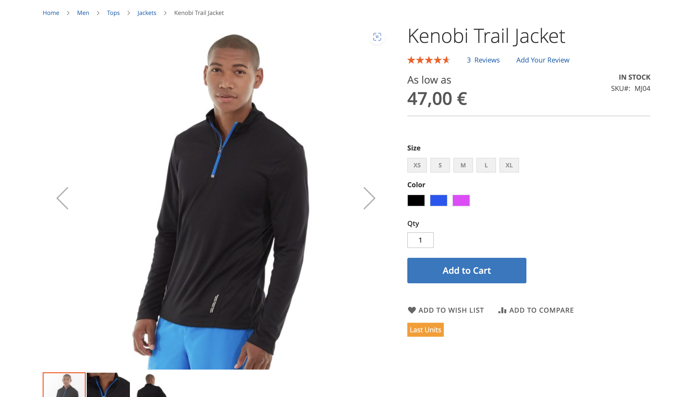
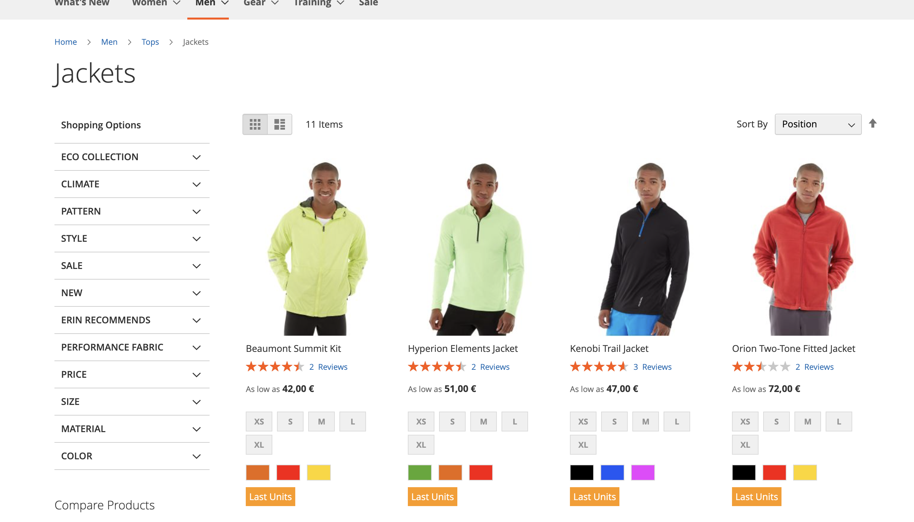

# Modulo Magento 2 - Skin7 Last Units

# Módulo de Categoria Personalizada para Magento 2 

## Este módulo para Magento 2 exibe uma tag "Last Units" nos produtos com estoque baixo. 

### Funcionalidades  
- Exibe uma tag "Last Units" em produtos com estoque baixo.

## Requisitos  
- Magento 2.4.x - Composer

## Instalação:

**Adicione o repositório e instale via Composer:**  

```
$# composer require test7skin/lastunits 
$# bin/magento module:enable Test7Skin_LastUnits
```
### Produto:

### Catalogo:
